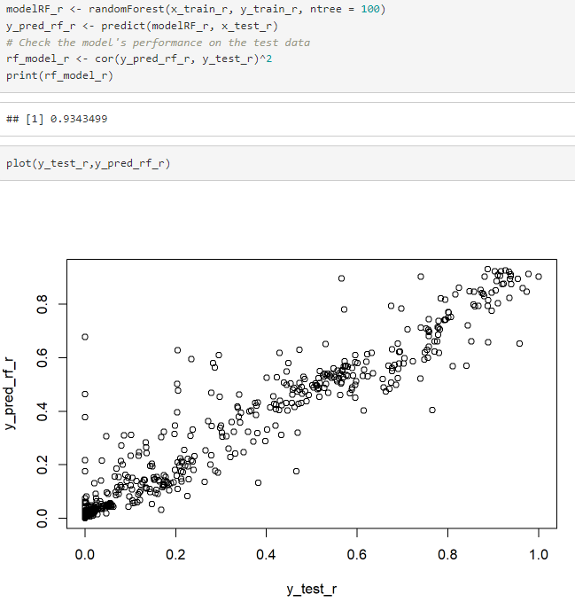
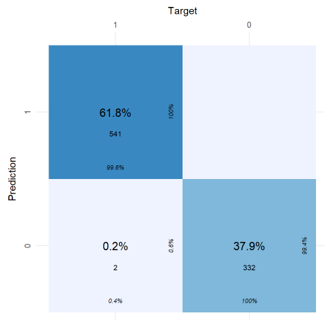
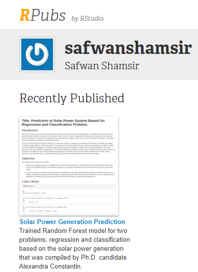

# Outcomes Prediction of Regression and Classification Problems Based On a Machine Learning Model; Random Foresst By Using R Programming for Solar Power Generation Dataset.
Trained Random Forest model using R programming language for two problems; regression and classification based on the solar power generation that was compiled by Ph.D. candidate Alexandra Constantin.

## Introduction
Solar power systems, also known as photovoltaic (PV) systems, are a popular choice for generating clean, renewable energy as they use solar panels to convert sunlight into electricity. These systems can be used for a variety of applications, making them an efficient and cost-effective source of electricity. In recent years, the development of solar power technology has been an active area of research and innovation, with efforts focused on improving the efficiency of solar power systems.

There are several factors that impact the efficiency of solar power systems, including the size and type of the system, the location and weather conditions, and the efficiency of the solar panels. The type and size of the solar power system are important considerations, as different systems are suited for different applications. For example, large systems may be more suitable for commercial or industrial applications, while small systems may be more suitable for residential use. The location and weather conditions also play a role in the efficiency of solar power systems, as the amount of sunlight received can vary significantly depending on the location and time of year. Finally, the efficiency of the solar panels themselves is an important factor, as more efficient panels can produce more electricity from the same amount of sunlight.

## Description
1. The first project's objectives is to identify the correlations between the available features and solar power generation: By analyzing the data and determining which factors have the most significant impact on solar power generation, the dataset can has a better understanding how to optimize the performance of a solar power system. The second project's objectives is to predict the output of a solar power system based on past performance: By using machine learning algorithms and historical data, a machine-learning model can be developed that accurately predicts the output of a solar power system based on various input parameters. This can help optimize the performance and efficiency of the system and make informed decisions about its operation and maintenance.
2. Based on the dataset description, the dataset is the output of a solar power system installed in Berkeley, California. The dataset also was compiled by a Ph.D. candidate, Alexandra Constantin.
3. The dataset contains13 continuous features, 3 categorical features, 2 type of targets; regression and classification. It has no duplicate data but has a lot of NaNs (which have been purposely dirty the dataset) and a lot of outliers from the dataset. The dataset can be downloaded from the link given in the credit section below.
4. For the regression problem, the target colum is 'Power Generated', while the target colum for the classification problem is 'Is Daylight' column.
5. By using only Random Forest model for both regression and classification, the model successfully achieved 93.4% and 99.0% accuracy respectively.
6. Methods that used to improve the model are by fine tuning the Random Forest model and removing the outliers. 

### Machine learning model link
[randomForest: Classification and Regression with Random Forest](https://www.rdocumentation.org/packages/randomForest/versions/4.7-1.1/topics/randomForest)

## Results

### Model score for regression:

### Model score for classification:

## Discussion
1. Based on the outcome of machine learning development and evaluation via Random Forest, the model is able to accurately predict the Power.Generated and Is.Daylight with accuracy score of 93% and 99% respectively for both regression and classification problem. In reference to the model evaluation, the model indicates very low MAE, RMSLE and RMSE (< 0.1) for regression problem and >0.99 for F1, AUC, Precision and Recall for classification problem. 
2. The adoption of Random Forest ifor both of regression and classification problem are considered successful in predicting the target output and can be used to improve the performance and efficiency of solar power systems in the future. 
3. This project documentation has been published in RPubs:
[Link for RPubs](https://rpubs.com/safwanshamsir/994854)

## Credits:
Shout out to Alexandra Constantin and Vipul Gote from Kaggle for the Solar Power Generation Dataset. Check out the dataset by clicking the link below. :smile:
### Dataset link
[Solar Power Generation Dataset](https://www.kaggle.com/datasets/vipulgote4/solar-power-generation?select=BigML_Dataset_5f50a4cc0d052e40e6000034.csv)
